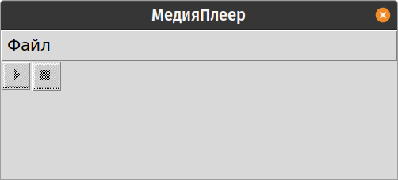

# Windows 4
My os written in python

Windows 4  installation is taken from this video: \
`https://www.youtube.com/watch?v=ggksNBpp5Vo` 

My tasks:
- [x] Add Welcome Screen
- [ ] Add start menu
  - [ ] Add Programs Menu
    - [ ] Add Accessories menu
      - [x] Add Games Menu
      	- [x] Add MineSweeper
      	- [x] Add Snake 
      	- [x] Add Parkour Game 
      	- [x] Add Solitaire
      - [x] Add Internet Tools Menu
        - [x] Add Internet Explorer <-
      - [ ] Add MultiMedia Menu
        - [ ] Add media player <-
      - [ ] Add System Tools Menu
      - [x] Add Calculator 
      - [x] Add Notepad
      - [x] Add Paint 
      - [x] Add WordPad
    - [ ] Add StartUp menu
    - [x] Add MS-DOS Prompt 
    - [x] Add Windows Explorer 
  - [ ] Add Documents Menu
  - [ ] Add find menu
  - [ ] Add settings menu
  - [ ] Add help
  - [ ] Add run
  - [ ] Add shutdown menu  
- [ ] Make file explorer

This is an image from browser

